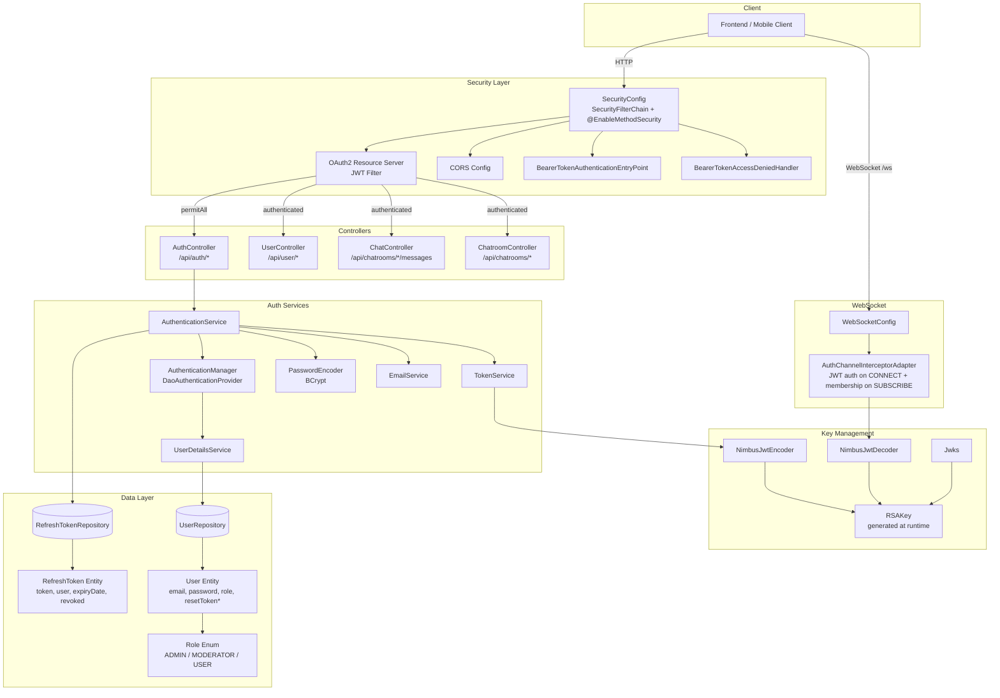
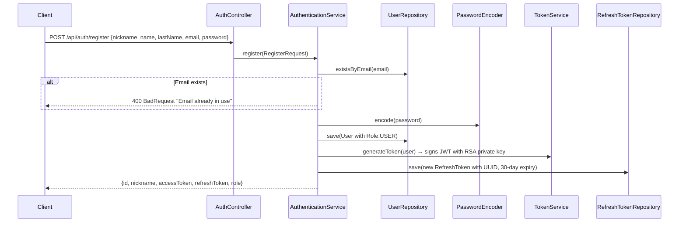
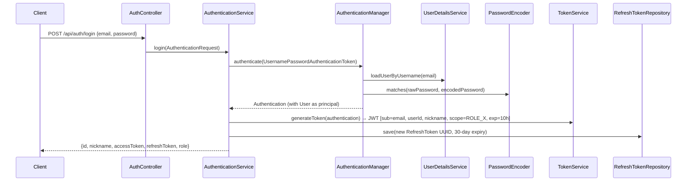
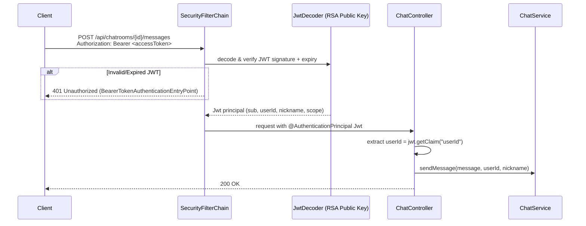
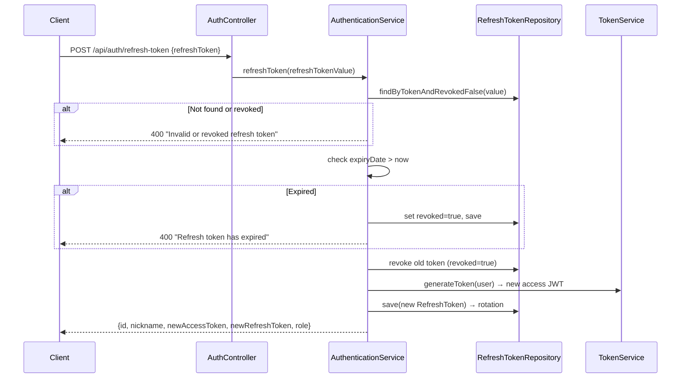
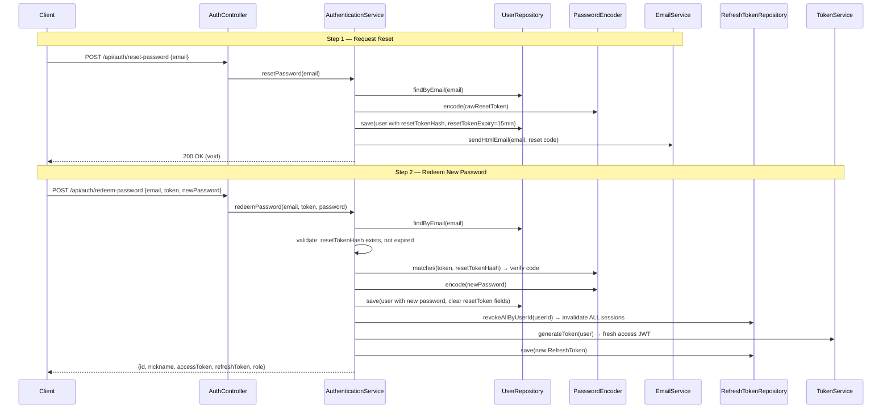

### Authentication & Authorization Architecture — Comprehensive Analysis

**Project:** `chat-backend` (Spring Boot)  
**Date:** 2026-04-17

---

### Component Overview (Mermaid Diagram)



---

### API Call Flows (Major Actions in Execution Order)

#### Registration Flow



#### Login Flow



#### Authenticated API Call Flow (e.g., ChatController)



#### Token Refresh Flow (Rotation)



#### Password Reset Flow



---

### How the Client Makes API Calls

The client authentication lifecycle works as follows:

1. **Initial Authentication:** Client calls `POST /api/auth/login` or `POST /api/auth/register` with credentials. The server returns an `accessToken` (JWT, 10-hour TTL) and a `refreshToken` (opaque UUID, 30-day TTL).

2. **Storing Tokens:** The client stores both tokens (typically in memory or secure storage — never in localStorage for the access token if possible).

3. **Making Authenticated Requests:** Every subsequent API call includes the header:
   ```
   Authorization: Bearer <accessToken>
   ```
   Spring's `oauth2ResourceServer` JWT filter intercepts the request, decodes and verifies the JWT signature using the RSA public key, checks expiry, and populates the `SecurityContext` with the authenticated principal.

4. **Token Renewal:** When the access token expires (or is close to expiring), the client calls `POST /api/auth/refresh-token` with the stored refresh token. The server performs **refresh token rotation** — it revokes the old refresh token and issues both a new access token and a new refresh token.

5. **WebSocket Connections:** The client connects to `/ws` (SockJS + STOMP) and passes the JWT in the `Authorization` STOMP header. The `AuthChannelInterceptorAdapter.preSend()` is **fully active**:
    - On `CONNECT`: validates the Bearer JWT using `JwtDecoder` and sets the authenticated user on the STOMP session.
    - On `SUBSCRIBE` to `/topic/chatroom/{id}/**`: verifies the user is a member of that chatroom via `chatroomService.isUserMemberOfChatroom()`. Non-members receive a `MessageDeliveryException`.
    - The `/ws/**` path remains `permitAll` at the HTTP filter level (required for the WebSocket handshake), but STOMP-level auth is enforced by the interceptor.

---

### Role-Based Authorization on Controllers

#### `SecurityConfig` — `@EnableMethodSecurity` is active

`SecurityConfig` is annotated with both `@EnableWebSecurity` and `@EnableMethodSecurity`, enabling `@PreAuthorize` across all controllers.

#### `UserController` — Current State

| Endpoint | Method | Authorization |
|----------|--------|---------------|
| `GET /api/user/me` | `getProfileData` | Authenticated (scoped to `Principal`) |
| `PUT /api/user/me` | `updateProfileData` | Authenticated (scoped to `Principal`) |
| `PUT /api/user/{userId}` | `updateUserInfo` | `SCOPE_ROLE_ADMIN` **or** owner (`userId == jwt.getClaim('userId')`) |
| `DELETE /api/user/{userId}` | `delete` | `SCOPE_ROLE_ADMIN` **or** owner (`userId == jwt.getClaim('userId')`) |

Both `PUT /{userId}` and `DELETE /{userId}` use the owner-or-admin pattern:
```java
@PreAuthorize("hasAuthority('SCOPE_ROLE_ADMIN') or #userId == authentication.credentials.getClaim('userId')")
```

#### `ChatroomController` — Current State

| Endpoint | Method | Authorization |
|----------|--------|---------------|
| `POST /api/chatrooms/{chatroomId}/members/{userId}` | `addChatroomMember` | `SCOPE_ROLE_ADMIN` or chatroom moderator |
| `DELETE /api/chatrooms/{chatroomId}/members/{userId}` | `removeChatroomMember` | `SCOPE_ROLE_ADMIN` or chatroom moderator |
| `GET /api/chatrooms/{chatroomId}/members` | `getMembersByChatroomId` | Authenticated |
| `POST /api/chatrooms/directChat` | `createDirectChat` | Authenticated |
| `POST /api/chatrooms/group` | `createGroupChat` | Authenticated |

Member management endpoints use:
```java
@PreAuthorize("hasAuthority('SCOPE_ROLE_ADMIN') or @chatroomService.isUserModeratorOfChatroom(#chatroomId, #jwt.getClaim('userId'))")
```

#### `AuthController` — Current State

All endpoints under `/api/auth/*` are `permitAll` in the security filter chain (no JWT required):

| Endpoint | Notes |
|----------|-------|
| `POST /api/auth/login` | Open |
| `POST /api/auth/register` | Open — `@PreAuthorize("hasAuthority('SCOPE_ROLE_ADMIN')")` is present but **commented out** |
| `POST /api/auth/reset-password` | Open |
| `POST /api/auth/redeem-password` | Open |
| `POST /api/auth/refresh-token` | Open |

---

### Auth Token Generation — Client Perspective

From the client's viewpoint, token generation is a black box:

| Step | Client Action | Server Response |
|------|--------------|-----------------|
| 1 | Send credentials to `/api/auth/login` or `/api/auth/register` | `{accessToken, refreshToken, id, nickname, role}` |
| 2 | Store both tokens | — |
| 3 | Attach `Authorization: Bearer <accessToken>` to every API call | Protected resource data |
| 4 | When access token expires (401 response) | — |
| 5 | Call `/api/auth/refresh-token` with stored refresh token | New `{accessToken, refreshToken}` pair |
| 6 | Replace both stored tokens | — |

**What's inside the access token (JWT)?**
```json
{
  "iss": "self",
  "sub": "user@email.com",
  "iat": 1713000000,
  "exp": 1713036000,
  "userId": 42,
  "nickname": "johndoe",
  "scope": "ROLE_USER"
}
```
Signed with RSA-256 private key (generated at runtime via `Jwks.generateRsa()`). The client never needs the private key — it only sends the opaque token string.

---

### Right Revocations & Password Resets

#### Token / Right Revocation Mechanisms

| Mechanism | How It Works | Scope |
|-----------|-------------|-------|
| **Refresh token rotation** | On every `/refresh-token` call, the old refresh token is marked `revoked=true` in DB. A new pair is issued. | Per-session |
| **Password reset revocation** | `redeemPassword()` calls `revokeAllByUserId(userId)` — all existing refresh tokens for the user are revoked. | All user sessions |
| **Refresh token expiry** | 30-day TTL checked at refresh time. Expired tokens are auto-revoked. | Per-token |
| **Access token expiry** | 10-hour TTL baked into the JWT. Cannot be revoked early (stateless). | Per-token |

**⚠️ Gap — Access Token Revocation:**  
Access tokens (JWTs) are **stateless** and cannot be individually revoked before expiry. If a user's role changes or account is compromised, the old JWT remains valid for up to 10 hours. Mitigation options:
- Shorten access token TTL (e.g., 15–30 minutes)
- Implement a token blacklist (in Redis) checked on every request
- Add a `tokenVersion` claim and check it against the DB

#### Password Reset Flow

1. Client requests reset via `POST /api/auth/reset-password` with email.
2. Server generates a random code (`ResetTokenGenerator`), hashes it with BCrypt, stores hash + 15-minute expiry on the `User` entity, and emails the raw code.
3. Client submits `POST /api/auth/redeem-password` with `{email, token, newPassword}`.
4. Server verifies the code against the stored hash, checks expiry, updates the password, **revokes ALL refresh tokens** (forcing all sessions to re-authenticate), clears the reset token fields, and returns a fresh token pair.

**Security properties:** Reset codes are hashed (not stored in plaintext), expire in 15 minutes, and a successful reset invalidates all existing sessions.

---

### Why Store Both accessToken and refreshToken in DB?

**Clarification:** The access token (JWT) is **NOT stored in the database**. Only the **refresh token** is persisted in the `refresh_token` table.

| Token | Storage | Format | Purpose |
|-------|---------|--------|---------|
| **Access Token** | Client-side only (memory/storage) | Signed JWT | Short-lived credential for API authorization (10h) |
| **Refresh Token** | Database (`refresh_token` table) + Client | Opaque UUID | Long-lived credential to obtain new access tokens (30 days) |

**Why the refresh token must be in the DB:**

1. **Revocation support:** JWTs are stateless — once issued, they can't be revoked. By storing refresh tokens in the DB with a `revoked` flag, the server can invalidate sessions on demand (password reset, account compromise, admin action).

2. **Rotation detection:** The server uses refresh token rotation — each refresh token is single-use. If a revoked token is presented (possible replay attack / token theft), the server can detect it and potentially revoke all tokens for that user.

3. **Session management:** The DB acts as a registry of active sessions. You can query all active refresh tokens per user, enforce max-session limits, or audit login history.

4. **Expiry enforcement:** While the client could tamper with local expiry checks, the server-side expiry in the DB is authoritative.

**Why NOT store the access token:**
- JWTs are self-contained and verified by signature — no DB lookup needed.
- Keeping API authorization stateless (no DB hit per request) is critical for performance, especially in a chat application.
- If revocation is needed, the short TTL + refresh token revocation provides an acceptable window.

---

### Security Gaps & Recommendations Summary

| # | Issue | Severity | Status | Recommendation |
|---|-------|----------|--------|----------------|
| 1 | `UserController` `PUT /{userId}` and `DELETE /{userId}` had no role checks | **Critical** | ✅ **Resolved** | Owner-or-admin `@PreAuthorize` applied |
| 2 | `ChatroomController` had no auth principal extraction or role checks | **High** | ✅ **Resolved** | Admin-or-moderator `@PreAuthorize` on member management endpoints |
| 3 | WebSocket `preSend` interceptor was commented out — no STOMP-level auth | **High** | ✅ **Resolved** | JWT validated on CONNECT, membership checked on SUBSCRIBE |
| 4 | `@EnableMethodSecurity` was missing on `SecurityConfig` | **Medium** | ✅ **Resolved** | Added — `@PreAuthorize` is now active across all controllers |
| 5 | Access tokens have 10-hour TTL with no revocation mechanism | **Medium** | ⚠️ **Open** | Reduce to 15–30 min or add a Redis blacklist |
| 6 | No rate limiting on `/api/auth/reset-password` | **Low** | ⚠️ **Open** | Add rate limiting to prevent email-bombing |
